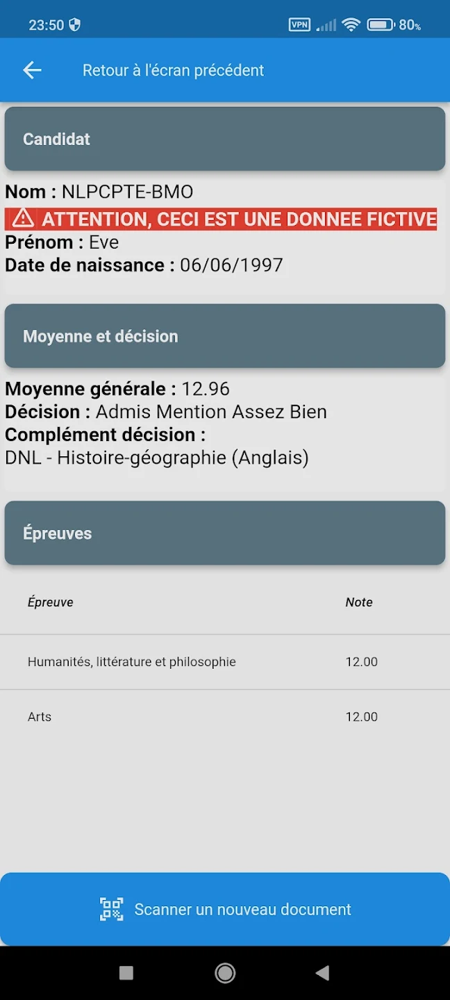

# Reverse Engineering the QR Code on my Diploma

(Read the blogpost at [obrhubr.org](obrhubr.org/reverse-engineering-diploma))

## Reverse Engineering

When graduating a French School, you get a PDF that has all the grades you obtained in your final examinations. The PDF has a QR code in the top right. Below it, there’s a reference to a mobile app, [CycladesVerif](https://play.google.com/store/apps/details?id=fr.edu.rennes.cyclades.mobile.verifcertif.verifDocEducNat&hl=de_AT). The app displays all important information already present in the document after scanning the QR code.

They use it to verify that you didn’t tamper with the PDF in order to boost your grades. The app store images provide an example of what it looks like after you have scanned a code:



The QR code from my PDF contains a simple base64 encoded string (which I knew because it ended in `==`).
After putting my phone in airplane mode I discovered I could still access the data through the app. This confirmed that both the data and the keys to decrypt it had to be contained in the app itself.

## Recreating the App in Python

The python code in `src/load_diploma.py` takes the QR code and returns structured data in the JSON format.

You have to replace the following variables:

```python
if __name__ == "__main__":
	key_der = b"XXXX" # replace by the public key
	qr_code = "02...XXX...==" # replace by your QR code

	diploma = load_diploma(key_der, qr_code)

	print(diploma)
```